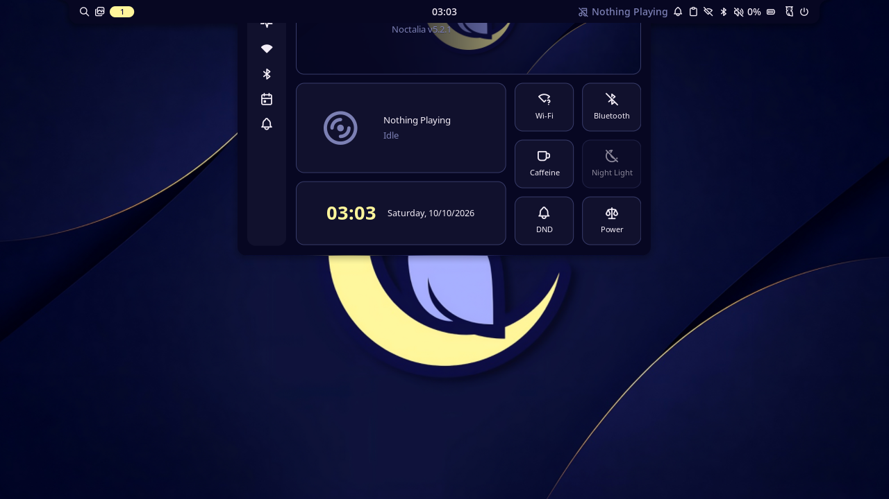

[Noctalia](https://github.com/noctalia-dev/noctalia-shell) is optional. Without it, everything except the three shell tools works the same.

## Detection

When the server starts, it looks for `noctalia` on `PATH`. If it is there, the server lists three more tools: `shell_status`, `shell_open` and `shell_close`, and a fourth, `noctalia`, when [`unrestricted`](../configuration/#unrestricted) is on. The tool list is fixed for the session, so install Noctalia before starting the agent.

The server talks to Noctalia over its socket, `$XDG_RUNTIME_DIR/noctalia-$WAYLAND_DISPLAY.sock`, with a two-second deadline. `status` reports `noctalia` as `running`, `not_running` with the reason in `noctalia_error`, or `not_installed`.

## What it adds

- Noctalia's `locked` is a second source for the [lock gate](../safety/#the-lock-gate), next to logind's, so the server knows the lock state even when niri isn't started with `--session`.
- `shell_status` returns Noctalia's own status: `barVisible`, `panelOpen`, `activePanelId` and `locked`. It is read-only.
- `shell_open` and `shell_close` open and close a panel, under the lease and the same checks as every action.

## Panels

Only three panels can be opened or closed:

| Panel | What it is |
|---|---|
| `control-center` | quick settings: Wi-Fi, Bluetooth, do not disturb and the like |
| `wallpaper` | the wallpaper picker |
| `tray-drawer` | the system tray |

Any other name, such as the session menu, which can power off, the launcher, which runs what is typed into it, polkit's password prompt or the clipboard history, is refused with `panel_not_allowed`, and nothing is sent.



*Noctalia's control center, opened by `shell_open` in a headless nested niri during the test suite. The server reported `{"accepted":true,"focused_window":null,"observed":"opened","shell":{"active_panel":"control-center"}}` 50 ms after the call.*

`shell_open` sends `panel-open`, then reads Noctalia's status every 100 ms for up to two seconds:

| `observed` | Means |
|---|---|
| `opened` | `activePanelId` is the panel |
| `closed` | (`shell_close`) it isn't any more |
| `timeout` | neither happened within two seconds |
| `uncertain` | Noctalia's reply, or a later status, was lost |

When the panel is already open, or already closed, nothing is sent and `accepted` is false. The result has `shell.active_panel`, the open panel when the observation ended.

An open panel holds keyboard focus, so `focused_window` is null while it is open. Type into it with `expect: "none"`.

## Any command

With [`unrestricted`](../configuration/#unrestricted) on, the `noctalia` tool sends any Noctalia command, the way `noctalia msg` does:

| Argument | Value |
|---|---|
| `args` (required) | 1 to 64 strings: the command and its arguments, as after `noctalia msg` |

The server joins `args` with spaces and sends them over the same socket, with the same two-second deadline, as `noctalia msg` does. Noctalia's `notification-show` is the one command `noctalia msg` rewrites (as JSON) before sending; send that JSON yourself. `observed` is `sent` and `noctalia` holds Noctalia's answer:

| Field | Value |
|---|---|
| `reply` | what `noctalia msg` would print, cut at 64 KiB |
| `truncated` | whether it was cut |

It reaches every command `noctalia msg` does, not only panels and plugins. Noctalia 5.2.1's include `session logout`, `reboot`, `shutdown`, `suspend` and `lock-and-suspend`; `dpms-off`; `screenshot-fullscreen` and `screenshot-region`, which write files and the clipboard; `clipboard-copy` and `clipboard-clear`, which replace or empty your clipboard with no restore and no secret hint, unlike `paste`; `config-reload`, `log-level-set` and `plugins`; and opening any panel, the launcher, the session menu and the clipboard history among them. It has no unlock command, so the tool can't get past `screen_locked`.

A reply starting `error:`, which makes `noctalia msg` exit 1, comes back as `upstream_error` with Noctalia's text, such as `Noctalia replied: error: unknown command (try: noctalia msg --help)`. A lost reply is `uncertain`: Noctalia acts before it answers. The tool needs the lease, stops at the stop key and is written to the audit log as the number of arguments and their lengths, with the first argument only when it is a plain command word of lowercase letters and `-`, such as `panel-open`.

This is how an agent can start a screen recording with Noctalia's OBS plugin, as a niri keybind would, since keybinds don't fire from the keyboard tools:

```json
{"args": ["plugin", "ayagmar/obs-control:controller", "all", "toggle-record"]}
```

## Paste and clipboard history

`paste` marks the text it puts on the clipboard with `x-kde-passwordManagerHint: secret`, so clipboard managers that honour the hint, Noctalia's among them, keep it out of their history. See [Keyboard and paste](../../tools/keyboard/#paste).
